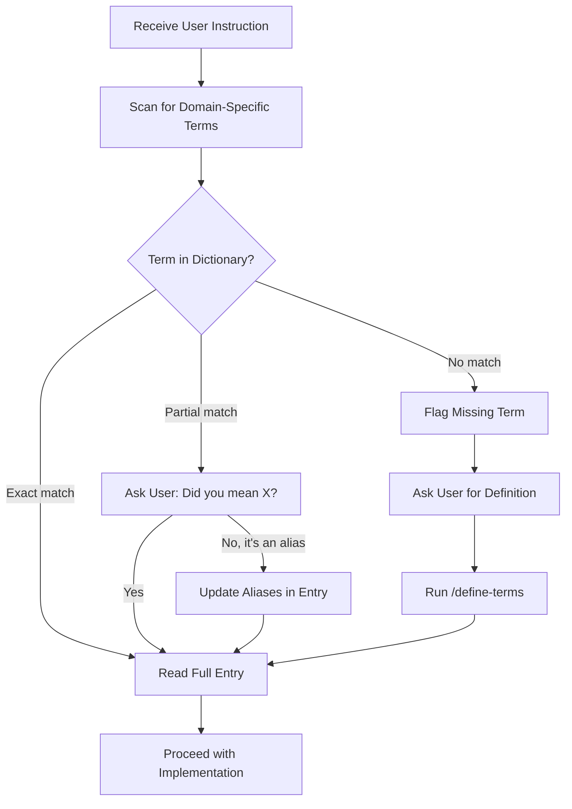
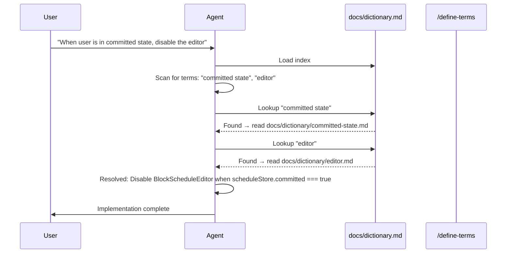
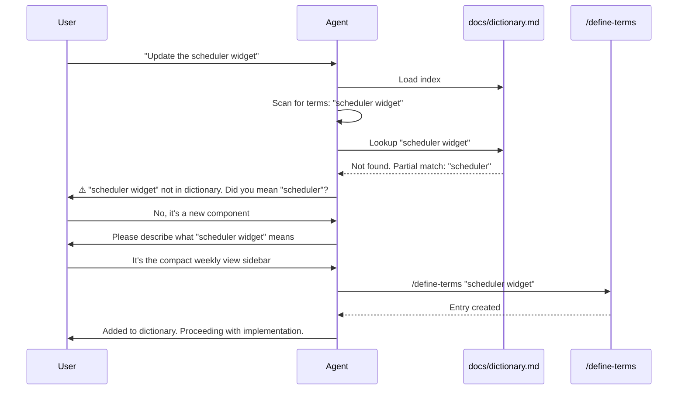

# Shared Vocabulary Protocol (add to CLAUDE.md)

## Dictionary Location

- **Index:** `docs/dictionary.md` — Load at session start
- **Full entries:** `docs/dictionary/[term].md` — Read on-demand

## How to Reference

1. Load `docs/dictionary.md` (the index) at session start
2. When you encounter a term from the index, read its full entry in `docs/dictionary/`
3. Use the dictionary definition—NOT your general knowledge
4. If a term is missing, follow the process below

## When a Term is Missing

If a keyword in the user's query does not exist in the dictionary:

1. **Flag it:** "⚠️ Term '[X]' not found in dictionary"
2. **Ask the user** for a definition or description
3. **Run `/define-terms "[X]"`** to create the entry using their input

Do NOT proceed with assumptions. The dictionary exists to prevent guesswork.

## When a Potential Match Exists

If a keyword in the user's query is similar to (but not exactly) an existing term:

1. **Ask for confirmation:** "Did you mean '[existing term]'?"
2. If yes → use that term's definition
3. If it's an alias → **update the entry's `Aliases` field** in `docs/dictionary/[term].md` to include the user's phrasing

## Do NOT

- ❌ Assume you know what a term means without checking
- ❌ Skip the dictionary lookup because a term seems obvious
- ❌ Proceed with ambiguous terms without asking

## When Modifying Code

If your changes affect files listed in any dictionary term's "Code Locations":

1. Re-read that term's full entry
2. Verify your changes align with the defined behavior
3. Update the dictionary entry if behavior has changed

## Maintenance Responsibility

After ANY code change that:
- Modifies a component/hook/store listed in a dictionary entry
- Introduces a new domain concept
- Changes the behavior of an existing concept

You MUST update `docs/dictionary.md` accordingly.

## The Lookup Pattern

