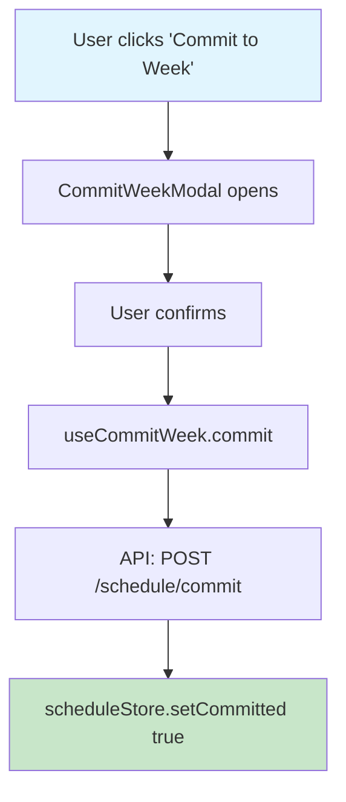

# Define Terms

## Terms to Define

$ARGUMENTS

## Before Starting

1. **Check for inconsistencies** in the provided terms — flag duplicates, overlapping concepts, or contradictory definitions
2. **Ask for clarification** if any term is vague, ambiguous, or could have multiple interpretations
3. Do not proceed until inconsistencies are resolved

## Mode

If `docs/dictionary.md` and `docs/dictionary/` already exist, **update** them by adding new entries. Do not recreate or overwrite existing entries unless explicitly asked.

## Initialisation: Ensure project CLAUDE.md Has Vocabulary Protocol

Check if `.claude/CLAUDE.md` contains a "Shared Vocabulary Protocol" section.

If **not present**:
1. Read `~/.claude/commands/claude-vocab-section.md
2. Append its contents to the project-level `CLAUDE.md`

This ensures agents know how to use the dictionary at runtime.

## Objective

Generate entries in `docs/dictionary.md` index file that serves as the canonical source of truth for domain-specific terminology in this project. The index is loaded at session start; full entries are read on-demand.

## The Problem This Solves

Terms like "committed state" or "editor" have project-specific meanings that differ from their general usage. Without explicit definitions, agents must guess—leading to misaligned implementations.

---

## Step 1: Audit & Discovery

Before writing definitions, conduct a full audit:

1. **Review the provided terms** (listed above in $ARGUMENTS)
2. **Scan the codebase** for:
   - Component names that imply domain concepts (e.g., `CommitWeekModal`, `BundleEditor`)
   - State variables with domain meaning (e.g., `isCommitted`, `editorMode`)
   - Comments or docs referencing undefined jargon
3. **Identify gaps** - Ask me clarifying questions for any term that is:
   - Ambiguous
   - Has multiple possible interpretations
   - References UI/UX states not fully described

**Output a list of all discovered terms before proceeding.** Wait for my confirmation before writing the dictionary.

## Codebase Scan

!`find src -name "*.tsx" -o -name "*.ts" 2>/dev/null | head -30`

---

## Step 2: Dictionary Structure

### File Organization

Structure the dictionary for **searchability**, not linear reading:

```
docs/
├── dictionary.md          # Main index with brief definitions
└── dictionary/
    ├── committed-state.md # Full entry with diagrams
    ├── editor.md
    ├── bundle.md
    └── ...
```

---

### Index Entry Format (in `dictionary.md`)

```markdown
## Index

| Term | Brief Definition | Details |
|------|------------------|---------|
| Committed State | Week schedule locked after user confirms | [→ Full Entry](dictionary/committed-state.md) |
| Editor | UI for setting block schedules per bundle/day | [→ Full Entry](dictionary/editor.md) |
| Bundle | A grouped set of scheduled items | [→ Full Entry](dictionary/bundle.md) |
```

---

### Full Entry Format

For EACH term, create a detailed entry in `docs/dictionary/[term-name].md`:

```markdown
## Committed State

<!-- KEYWORDS: commit, committed, locked, finalized, week, schedule, readonly, lock -->

**Aliases:** Locked state, Finalized week

**Brief Definition:**  
The state when a user has clicked "Commit to Week" and the schedule is locked.

**Detailed Definition:**  
The application state entered when a user explicitly confirms their schedule for a given week. Once committed, the schedule becomes read-only—no blocks can be added, removed, or modified for that week. This is distinct from simply "saving" which allows further edits.

**Context/Trigger:**  
- User clicks "Commit to Week" button in schedule view
- Requires explicit confirmation in modal
- Irreversible for that week

**Code Locations:**
- `src/components/CommitWeekModal.tsx` - Confirmation modal
- `src/hooks/useCommitWeek.ts` - Commit logic
- `src/stores/scheduleStore.ts` - State: `committed: boolean`

**Call Stack:**



**Related Terms:** Editor, Draft State, Bundle

**Anti-definitions (What this is NOT):**  
- ❌ NOT the same as "saving" (saves are editable)
- ❌ NOT auto-triggered (requires explicit user action)
- ❌ NOT reversible within the same week

**Visual Reference:** `docs/screenshots/committed-state.png`
```

---

## Step 3: Code Traceability

For each key term, generate a Mermaid diagram showing the call stack.

**Process:**
- Use a subagent (model: `sonnet`) to trace each term
- Document component tree, hooks, and state mutations
- Embed diagram in the term's entry

**Example:**


---

## Deliverables Checklist

- [ ] `docs/dictionary.md` - Searchable vocabulary index
- [ ] `docs/dictionary/[term].md` - Full entry for each term
- [ ] Mermaid call stack diagrams in each entry
- [ ] Keyword tags for efficient searching