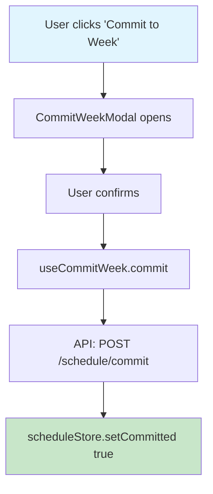
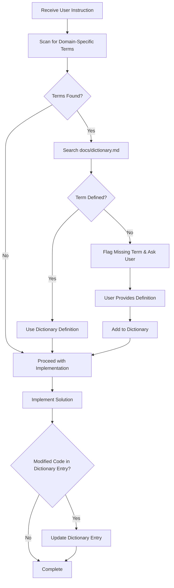
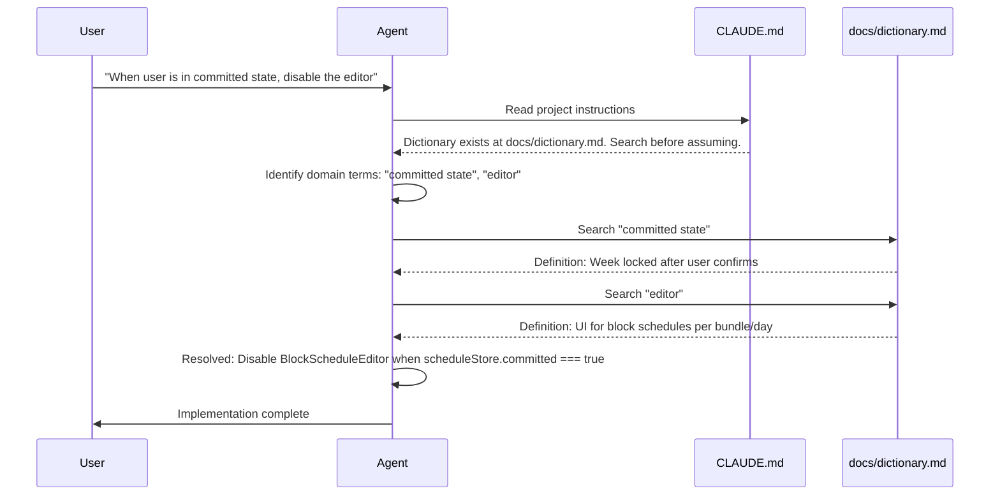

# Define Terms

## Terms to Define

$ARGUMENTS

## Before Starting

1. **Check for inconsistencies** in the provided terms — flag duplicates, overlapping concepts, or contradictory definitions
2. **Ask for clarification** if any term is vague, ambiguous, or could have multiple interpretations
3. Do not proceed until inconsistencies are resolved

## Mode

If `docs/dictionary.md` and `docs/dictionary/` already exist, **update** them by adding new entries. Do not recreate or overwrite existing entries unless explicitly asked.

## Objective

Generate entries in `docs/dictionary.md` index file that serves as the canonical source of truth for domain-specific terminology in this project. The index is loaded at session start; full entries are read on-demand.

## The Problem This Solves

Terms like "committed state" or "editor" have project-specific meanings that differ from their general usage. Without explicit definitions, agents must guess—leading to misaligned implementations.

---

## Step 1: Audit & Discovery

Before writing definitions, conduct a full audit:

1. **Review the provided terms** (listed above in $ARGUMENTS)
2. **Scan the codebase** for:
   - Component names that imply domain concepts (e.g., `CommitWeekModal`, `BundleEditor`)
   - State variables with domain meaning (e.g., `isCommitted`, `editorMode`)
   - Comments or docs referencing undefined jargon
3. **Identify gaps** - Ask me clarifying questions for any term that is:
   - Ambiguous
   - Has multiple possible interpretations
   - References UI/UX states not fully described

**Output a list of all discovered terms before proceeding.** Wait for my confirmation before writing the dictionary.

## Codebase Scan

!`find src -name "*.tsx" -o -name "*.ts" 2>/dev/null | head -30`

---

## Step 2: Dictionary Structure

### File Organization

Structure the dictionary for **searchability**, not linear reading:

```
docs/
├── dictionary.md          # Main index with brief definitions
└── dictionary/
    ├── committed-state.md # Full entry with diagrams
    ├── editor.md
    ├── bundle.md
    └── ...
```

---

### Index Entry Format (in `dictionary.md`)

```markdown
## Index

| Term | Brief Definition | Details |
|------|------------------|---------|
| Committed State | Week schedule locked after user confirms | [→ Full Entry](dictionary/committed-state.md) |
| Editor | UI for setting block schedules per bundle/day | [→ Full Entry](dictionary/editor.md) |
| Bundle | A grouped set of scheduled items | [→ Full Entry](dictionary/bundle.md) |
```

---

### Full Entry Format

For EACH term, create a detailed entry in `docs/dictionary/[term-name].md`:

```markdown
## Committed State

<!-- KEYWORDS: commit, committed, locked, finalized, week, schedule, readonly, lock -->

**Also known as:** Locked state, Finalized week

**Brief Definition:**  
The state when a user has clicked "Commit to Week" and the schedule is locked.

**Detailed Definition:**  
The application state entered when a user explicitly confirms their schedule for a given week. Once committed, the schedule becomes read-only—no blocks can be added, removed, or modified for that week. This is distinct from simply "saving" which allows further edits.

**Context/Trigger:**  
- User clicks "Commit to Week" button in schedule view
- Requires explicit confirmation in modal
- Irreversible for that week

**Code Locations:**
- `src/components/CommitWeekModal.tsx` - Confirmation modal
- `src/hooks/useCommitWeek.ts` - Commit logic
- `src/stores/scheduleStore.ts` - State: `committed: boolean`

**Call Stack:**



**Related Terms:** Editor, Draft State, Bundle

**Anti-definitions (What this is NOT):**  
- ❌ NOT the same as "saving" (saves are editable)
- ❌ NOT auto-triggered (requires explicit user action)
- ❌ NOT reversible within the same week

**Visual Reference:** `docs/screenshots/committed-state.png`
```

---

## Step 3: Code Traceability

For each key term, generate a Mermaid diagram showing the call stack.

**Process:**
- Use a subagent (model: `sonnet`) to trace each term
- Document component tree, hooks, and state mutations
- Embed diagram in the term's entry

**Example:**


---

## Step 4: Update CLAUDE.md (Critical)

Add this section to `CLAUDE.md` to ensure agents always reference the dictionary:

```markdown
## ⚠️ Shared Vocabulary Protocol

### Dictionary Location
- **Index:** `docs/dictionary.md` — Load this at session start
- **Full entries:** `docs/dictionary/[term].md` — Search on-demand

### How to Reference

1. Load `docs/dictionary.md` (the index) at session start
2. When you encounter a term from the index, read its full entry in `docs/dictionary/`
3. Use the dictionary definition—NOT your general knowledge
4. If a term is missing, flag it and ask for clarification

**Example workflow:**
```
User: "When the user is in a committed state, disable the editor"

Agent thinks:
- "committed state" → in index → read docs/dictionary/committed-state.md
- "editor" → in index → read docs/dictionary/editor.md
- Now I understand: disable block schedule UI when week is locked
```

### Do NOT:
- ❌ Assume you know what a term means without checking
- ❌ Skip the dictionary lookup because a term seems obvious

### When Modifying Code

If your changes affect files listed in any dictionary term's "Code Locations":
1. Re-read that term's full entry
2. Verify your changes align with the defined behavior
3. Update the dictionary entry if behavior has changed

### When You Encounter an Undefined Term

If a term seems domain-specific but isn't in the dictionary:
1. Flag it in your response: "⚠️ Term '[X]' not found in dictionary"
2. Ask the user for a definition
3. Suggest adding it to the dictionary

### Maintenance Responsibility

After ANY code change that:
- Modifies a component/hook/store listed in a dictionary entry
- Introduces a new domain concept
- Changes the behavior of an existing concept

You MUST update `docs/dictionary.md` accordingly.
```

---

## Deliverables Checklist

- [ ] `docs/dictionary.md` - Searchable vocabulary index + full entries
- [ ] `docs/dictionary/[term].md` - Full entry for each term
- [ ] Mermaid diagrams for each term's code flow
- [ ] Updated `CLAUDE.md` with Shared Vocabulary Protocol
- [ ] List of terms needing clarification
- [ ] Keyword tags for efficient searching

---

## Summary: The Lookup Pattern





This pattern keeps context lean while ensuring vocabulary alignment.