# Claude Docker Architecture Diagrams

This document contains Mermaid diagrams explaining the internals of each core script.

Note: Diagrams use `~/.claude-docker` as the default host path. You can override this with `CLAUDE_DOCKER_HOME`.

---

## System Overview

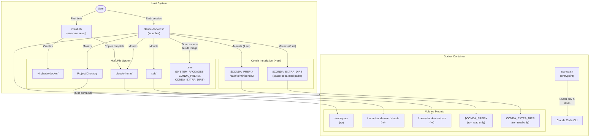

---

## 1. install.sh - One-Time Setup

### Flow Diagram

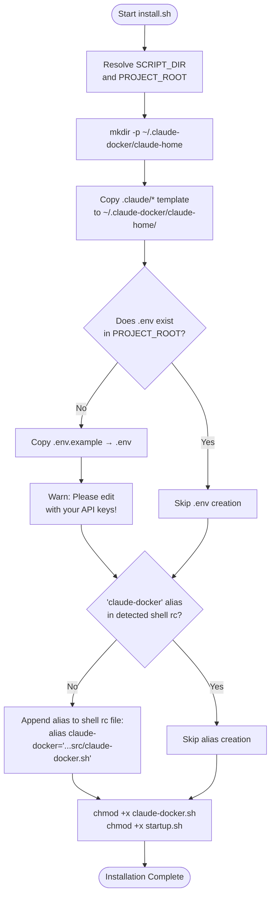

### Files Created/Modified

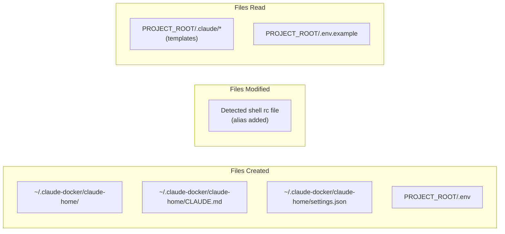

---

## 2. claude-docker.sh - Main Launcher

### Argument Parsing

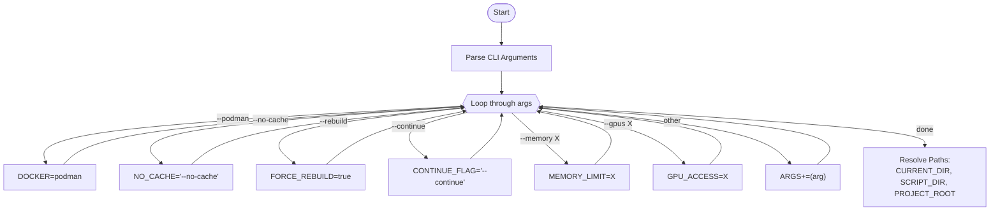

### Main Flow

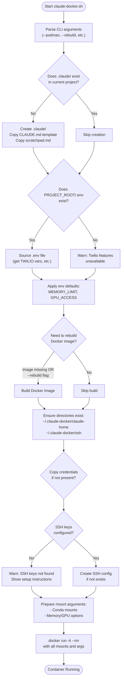

### Docker Build Process

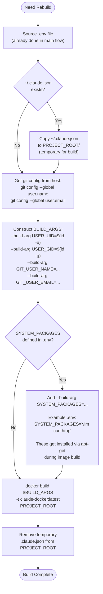

### Volume Mounts

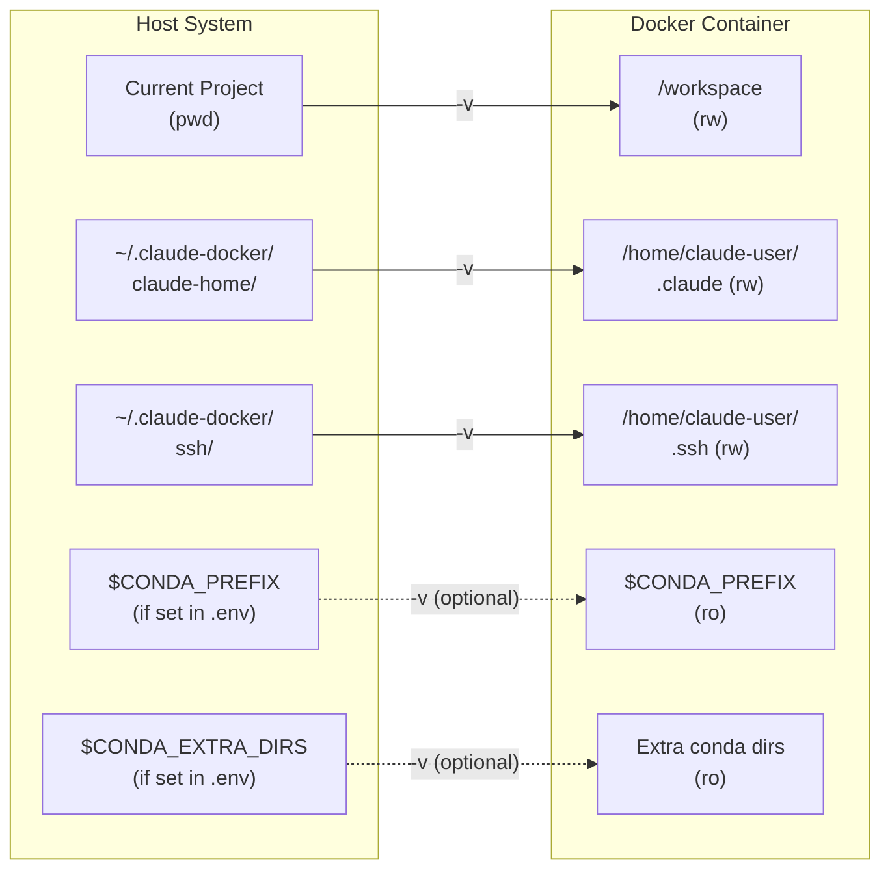

### Conda Mounting Logic

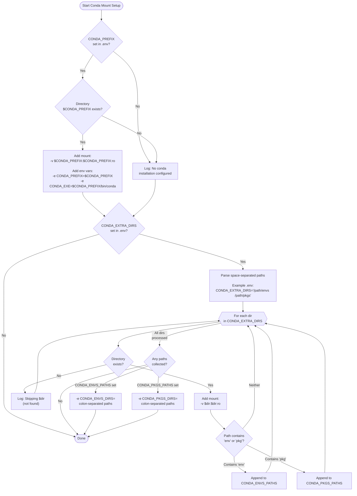

### Conda Mount Example

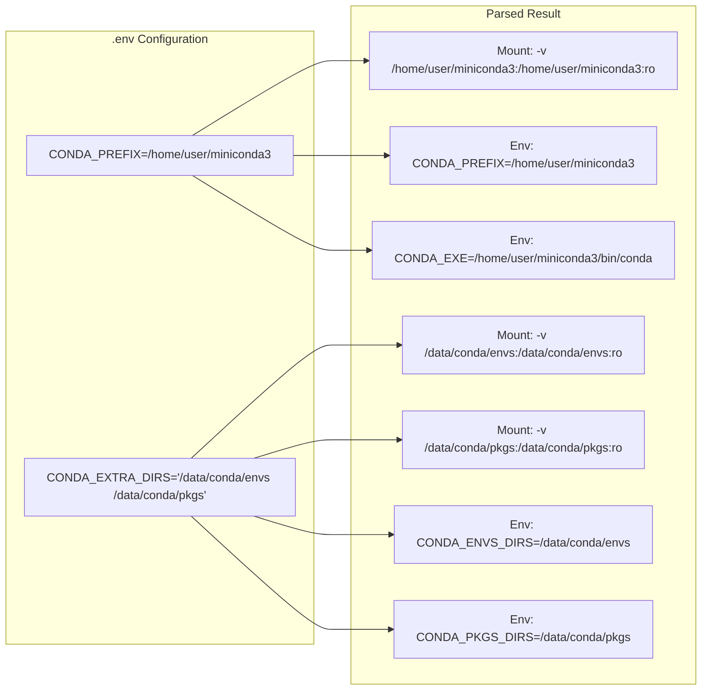

---

## 3. startup.sh - Container Entrypoint

### Flow Diagram

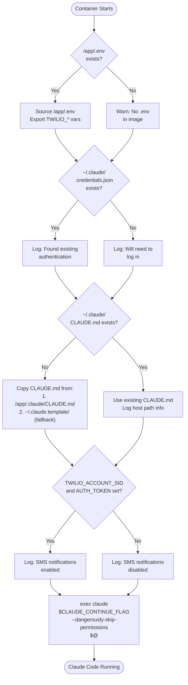

### Environment Variables

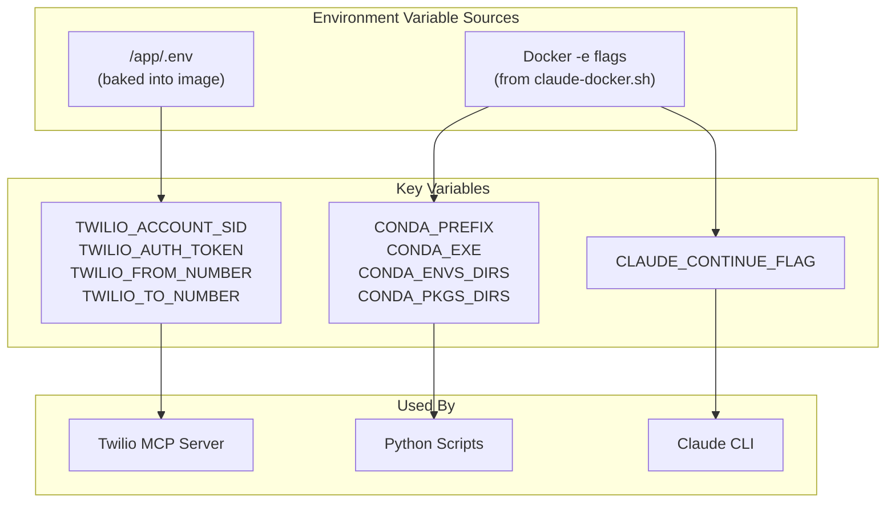

### Files Accessed Inside Container

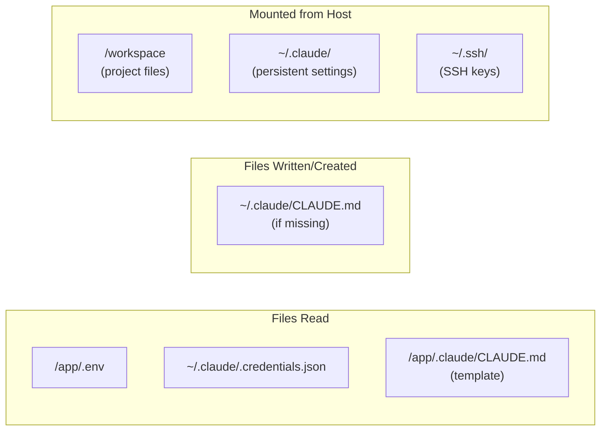

---

## Complete Data Flow

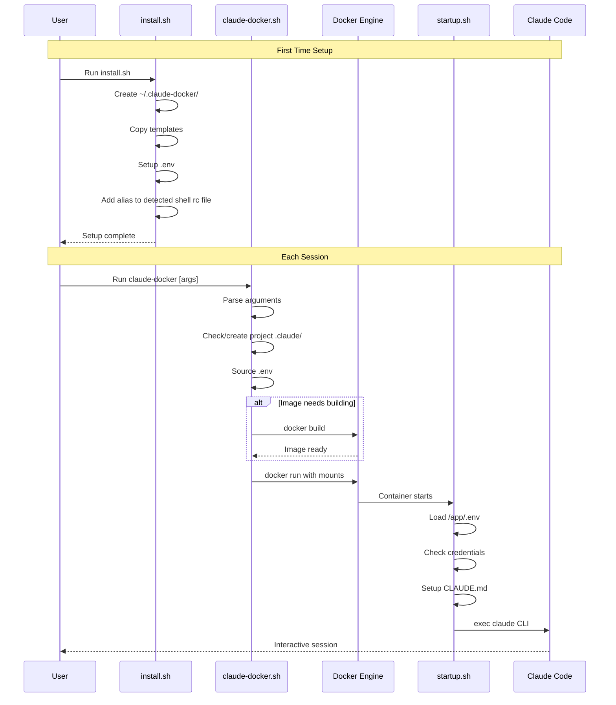

---

## Directory Structure

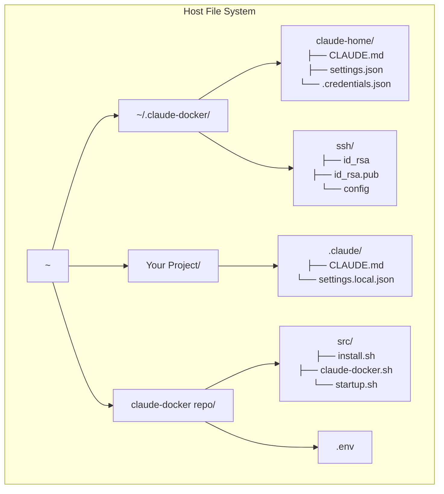

---

## Quick Reference

| Script | Purpose | When Run | Key Actions |
|--------|---------|----------|-------------|
| `install.sh` | One-time setup | Once after cloning | Creates directories, copies templates, adds shell alias |
| `claude-docker.sh` | Launch wrapper | Each session | Builds image if needed, sets up mounts, runs container |
| `startup.sh` | Container entrypoint | Inside container | Loads env, checks auth, starts Claude CLI |
